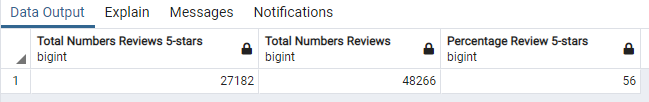
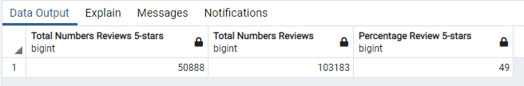

# Amazon_Vine_Analysis

The Amazon Vine program is a service that allows manufacturers and publishers to receive reviews for their products. 
Working for SellBy, a company who pay a small fee to Amazon and provide products to Amazon Vine members, who are then required to publish a review, we pick one dataset out of a pool of ~50 to determine if there is any bias toward favorable reviews from Vine members in it. 
Our analysis it's to  determine if having a paid Vine review makes a difference in the percentage of 5-star reviews.

# Results:

To analyse any trends in the data, we start by filtering it:

- Retrieve the total votes numbers equal to or greater than 20 to pick reviews that are more likely to be helpful.
- Retrieve all the rows where the number of helpful_votes divided by total votes is equal to or greater than 50%.

Then, we get the data where a review was written as part of the Vine program (paid), and the one where the review was not part of the Vine program (unpaid).
 
Looking at the Vine program reviews (paid):

- There is a total of 48.266 reviews as part of the paid program.
- There is a total of 27.182 5-star reviews as part of the paid program.
- The percentage of 5-stars reviews is 56% of the total reviews for the paid program. 
 

 

Looking at the not Vine program reviews (unpaid):

- There is a total of 103.183 reviews as part of the unpaid program.
- There is a total of 50.888 5-star reviews as part of the unpaid program.
- The percentage of 5-stars reviews is 49% of the total reviews for the unpaid program. 
 

 

# Summary:

In regard of the results there are fewer reviews for the paid  program (48.266) in comparison of the unpaid (103.183). The percentage of 5-stars reviews is higher for the paid program (56% > 49%). 
We can conclude that reviewer tends to give a better ratings in the paid program keeping in mind that there is less review given.
Knowing that one Vine program require payment, it might have a bias in the results given the fact that reviewer is required to give a review.
 
An additional analysis could consist of analyse only showcasing results between two paid Vine programs and not between a paid and unpaid ones.